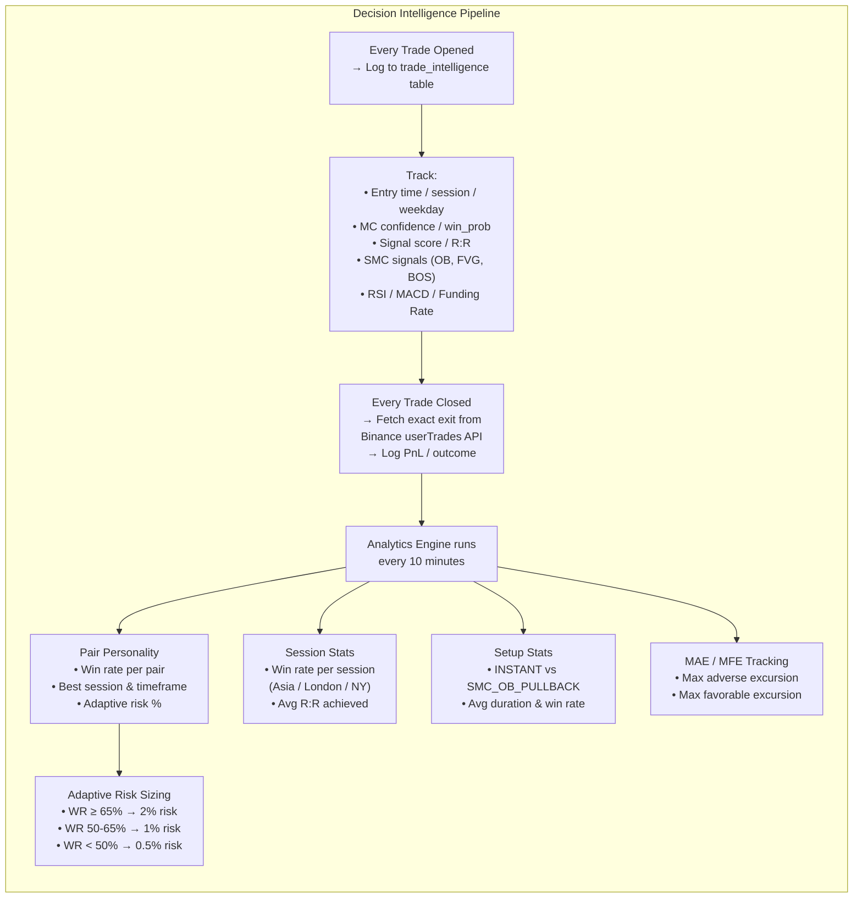

<div align="center">

```
╔══════════════════════════════════════════════════════════════╗
║          ███╗   ██╗███████╗██████╗  █████╗                  ║
║          ████╗  ██║██╔════╝██╔══██╗██╔══██╗                 ║
║          ██╔██╗ ██║█████╗  ██████╔╝███████║                 ║
║          ██║╚██╗██║██╔══╝  ██╔══██╗██╔══██║                 ║
║          ██║ ╚████║███████╗██║  ██║██║  ██║                 ║
║          ╚═╝  ╚═══╝╚══════╝╚═╝  ╚═╝╚═╝  ╚═╝                ║
║                                                              ║
║            Q U A N T   T R A D I N G   A I   v1.0           ║
║        Monte Carlo Probability Engine • SMC Intelligence     ║
╚══════════════════════════════════════════════════════════════╝
```

[](https://python.org)
[](https://testnet.binancefuture.com)
[](https://ai.google.dev)
[](https://core.telegram.org/bots)
[](LICENSE)

**🇬🇧 English** | **🇮🇩 Bahasa Indonesia**

</div>

---

## 📋 Table of Contents / Daftar Isi

- [🌐 Overview / Gambaran Umum](#-overview--gambaran-umum)
- [🏗️ System Architecture / Arsitektur Sistem](#️-system-architecture--arsitektur-sistem)
- [🔄 Main Flowchart / Flowchart Utama](#-main-flowchart--flowchart-utama)
- [🧠 Core Engines / Mesin Utama](#-core-engines--mesin-utama)
  - [Monte Carlo Engine](#-monte-carlo-probability-engine)
  - [SMC Intelligence](#-smart-money-concepts-smc-intelligence)
  - [Decision Intelligence System](#-decision-intelligence-system)
  - [Risk Management](#️-risk-management-pipeline)
- [🛡️ Safety Features / Fitur Keamanan](#️-safety-features--fitur-keamanan)
- [📊 Technical Indicators](#-technical-indicators)
- [📁 File Structure / Struktur File](#-file-structure--struktur-file)
- [⚙️ Configuration / Konfigurasi](#️-configuration--konfigurasi)
- [🚀 Installation & Usage / Instalasi & Penggunaan](#-installation--usage--instalasi--penggunaan)
- [📡 Dashboard & Notifications](#-dashboard--notifications)
- [🗄️ Database Schema](#️-database-schema)
- [🤖 AI Integration (Gemini 2.5 Pro)](#-ai-integration-gemini-25-pro)

---

## 🌐 Overview / Gambaran Umum

### 🇬🇧 English
**NERA QUANT** is an autonomous algorithmic trading AI system built for **Binance Futures**. It continuously scans the **Top 50 USDT perpetual pairs** and combines probabilistic Monte Carlo simulation with **Smart Money Concepts (SMC)** to generate high-confidence trading signals. When a signal meets strict multi-layer thresholds, the system automatically executes bracket orders (Entry + TP + SL) and actively manages open positions in real time.

The system also integrates **Gemini 2.5 Pro** as a CIO Agent that reviews charts before any trade is approved, making it a fully autonomous, AI-supervised trading bot.

### 🇮🇩 Bahasa Indonesia
**NERA QUANT** adalah sistem trading algoritmik AI otonom yang dibangun untuk **Binance Futures**. Sistem ini secara kontinu memindai **Top 50 pair USDT perpetual** dan menggabungkan simulasi Monte Carlo probabilistik dengan **Smart Money Concepts (SMC)** untuk menghasilkan sinyal trading dengan confidence tinggi. Ketika sinyal memenuhi threshold multi-layer yang ketat, sistem secara otomatis mengeksekusi bracket order (Entry + TP + SL) dan mengelola posisi terbuka secara real-time.

Sistem ini juga mengintegrasikan **Gemini 2.5 Pro** sebagai CIO Agent yang meninjau chart sebelum trade disetujui, menjadikannya bot trading otonom yang diawasi AI secara penuh.

---

## 🏗️ System Architecture / Arsitektur Sistem

```
┌──────────────────────────────────────────────────────────────────────────────────┐
│                        NERA QUANT — System Architecture                          │
├──────────────────────────────────────────────────────────────────────────────────┤
│                                                                                  │
│   ┌─────────────────┐    ┌────────────────────────────────────────────────────┐  │
│   │   EXTERNAL APIs  │    │              CORE PROCESSING LAYER                │  │
│   ├─────────────────┤    ├────────────────────────────────────────────────────┤  │
│   │  Binance Futures │───▶│  market_data.py  │  indicators.py  │  monte_carlo │  │
│   │  (REST + WS)     │    │  Top 50 Pairs    │  EMA/RSI/MACD   │  5,000 paths │  │
│   │  testnet.binance │    │  OHLCV + Ticker  │  SMC Detection  │  GBM Engine  │  │
│   ├─────────────────┤    ├────────────────────────────────────────────────────┤  │
│   │  ForexFactory    │───▶│             ORCHESTRATION LAYER                   │  │
│   │  News Calendar   │    │   scanner.py — NeraScanner (Main Loop 15s)        │  │
│   │  (XML Feed)      │    │   ├── CircuitBreaker     ├── PendingSetups        │  │
│   ├─────────────────┤    │   ├── NewsBlackout        ├── ActiveTrade Monitor  │  │
│   │  X.com / Nitter  │───▶│   └── AdaptiveRisk       └── Binance Sync (auto)  │  │
│   │  (Macro Tweets)  │    ├────────────────────────────────────────────────────┤  │
│   ├─────────────────┤    │               EXECUTION LAYER                     │  │
│   │  Gemini 2.5 Pro  │◀──▶│   trader.py — BinanceTrader                      │  │
│   │  (CIO Agent)     │    │   ├── Spread Check       ├── Safe Leverage        │  │
│   └─────────────────┘    │   ├── Risk Sizing         ├── Market Order         │  │
│                           │   ├── TP1/TP2 Algo Order  └── SL Algo Order       │  │
│   ┌─────────────────┐    ├────────────────────────────────────────────────────┤  │
│   │  OUTPUT LAYER    │    │               ANALYTICS & INTELLIGENCE            │  │
│   ├─────────────────┤    │   analytics_engine.py  │  database.py (SQLite)     │  │
│   │  dashboard.html  │◀──│   Pair Personality      │  Trade Intelligence      │  │
│   │  (Web UI :8000)  │    │   Session Stats         │  MAE / MFE Tracking      │  │
│   ├─────────────────┤    │   Setup Stats           │  Consecutive Losses      │  │
│   │  Telegram Bot    │◀──│   AI Retrospective       │  Pair Stats              │  │
│   │  (Notifier)      │    └────────────────────────────────────────────────────┤  │
│   └─────────────────┘                                                          │
└──────────────────────────────────────────────────────────────────────────────────┘
```

---

## 🔄 Main Flowchart / Flowchart Utama

```mermaid
flowchart TD
    %% Styling
    classDef trigger fill:#1e1e2e,stroke:#cba6f7,stroke-width:2px,color:#cdd6f4
    classDef data fill:#1e3a5f,stroke:#89b4fa,stroke-width:2px,color:#cdd6f4
    classDef indicator fill:#1a3a1a,stroke:#a6e3a1,stroke-width:2px,color:#cdd6f4
    classDef mc fill:#3a2a00,stroke:#f9e2af,stroke-width:2px,color:#cdd6f4
    classDef execution fill:#3a0a0a,stroke:#f38ba8,stroke-width:2px,color:#cdd6f4
    classDef output fill:#003a35,stroke:#94e2d5,stroke-width:2px,color:#cdd6f4
    classDef safety fill:#3a1a00,stroke:#fab387,stroke-width:2px,color:#cdd6f4
    classDef decision fill:#2a0a3a,stroke:#cba6f7,stroke-width:2px,color:#cdd6f4

    %% ═══════════════════════════════════════
    %% 1. SCHEDULER & CORE LOOP
    %% ═══════════════════════════════════════
    subgraph CoreLoop ["⏰ 1. Scheduler & Core Loop"]
        A["Every 15 Seconds\n(SCAN_INTERVAL_SECONDS)"]:::trigger
        B["NeraScanner\n(scanner.py)"]:::trigger
        A --> B
    end

    %% ═══════════════════════════════════════
    %% 2. SAFETY PRE-CHECKS
    %% ═══════════════════════════════════════
    subgraph SafetyGate ["🛡️ 2. Safety Pre-Checks"]
        CB{{"Circuit Breaker\nCheck"}}:::decision
        NB{{"News Blackout\nActive?"}}:::decision
        B --> CB
        CB -- "5+ losses → pause 4h" --> PAUSE["⛔ Suspend New Trades\n(monitoring only)"]:::safety
        CB -- "3+ losses → risk -50%" --> CB2["⚠️ Risk Reduction Mode\n(50% normal risk)"]:::safety
        CB -- "OK" --> NB
        NB -- "Blackout Active" --> BE_MOVE["Move All Active\nSL → Breakeven"]:::safety
        NB -- "OK" --> DataFetch
    end

    %% ═══════════════════════════════════════
    %% 3. MARKET DATA RETRIEVAL
    %% ═══════════════════════════════════════
    subgraph DataFetch ["📡 3. Market Data Retrieval (market_data.py)"]
        C["Top 50 USDT Pairs\n(Volume Filtered > 5M)"]:::data
        D["OHLCV Klines 150 candle\n15m + 1h (Multi-TF)"]:::data
        E["Ticker Price\nFunding Rate\nOpen Interest"]:::data
        C --> D --> E
    end

    %% ═══════════════════════════════════════
    %% 4. TECHNICAL ANALYSIS
    %% ═══════════════════════════════════════
    subgraph IndicatorEngine ["📊 4. Indicator & SMC Engine (indicators.py)"]
        F["Classic Indicators\n(EMA 9/21/50, RSI, MACD,\nBollinger Bands, ATR, OBV,\nStochastic RSI)"]:::indicator

        subgraph SMCBlock ["Smart Money Concepts (SMC)"]
            G1["🔺 Swing High / Low\n(window=5 candles)"]:::indicator
            G2["💥 BOS & CHoCH\n(Structure Break Detection)"]:::indicator
            G3["📦 Unmitigated Order Blocks\n(Bullish / Bearish OB)"]:::indicator
            G4["⚡ Fair Value Gaps\n(FVG Imbalance)"]:::indicator
        end

        H["get_signal_features()\nExtract 25+ feature dict"]:::indicator
        E --> F
        F --> G1 & G2 & G3 & G4
        G1 & G2 & G3 & G4 --> H
    end

    %% ═══════════════════════════════════════
    %% 5. MONTE CARLO ENGINE
    %% ═══════════════════════════════════════
    subgraph MCEngine ["🎲 5. Monte Carlo Engine (monte_carlo.py)"]
        I["Composite Confluence Voting\n(Weighted Indicator System)"]:::mc

        subgraph Voting ["Signal Scoring Breakdown"]
            I1["Classic Technical:\nEMA±2.0 MACD±2.0 RSI±1.5\nBB±1.0 Volume±1.5 Stoch±1.5"]:::mc
            I2["SMC Confluence:\nBOS/CHoCH +3.0 | OB Retest +2.5\nFVG Attraction +1.5"]:::mc
            I3["HTF 1H Gatekeeper\n❌ Block counter-trend trades"]:::mc
        end

        J["Direction Decision\nLONG / SHORT / NEUTRAL"]:::mc

        subgraph Simulation ["GBM Path Simulation"]
            K1["SMC-Aware TP Level\n(Opposite OB boundary)"]:::mc
            K2["SMC-Aware SL Level\n(OB edge + 0.5 ATR buffer)"]:::mc
            K3["R/R Safeguard\nMin 1:1.5 enforced"]:::mc
            L["Geometric Brownian Motion\n5,000 Parallel Paths"]:::mc
            L1["FVG Gravity Effect\nMagnetic drift toward gap center"]:::mc
            L2["OB Elastic Barrier\n75% bounce probability at OB"]:::mc
        end

        M["Win Probability &\nExpected Return\nConfidence = WinProb×60% + Score×40%"]:::mc

        H --> I
        I --> I1 & I2 & I3
        I1 & I2 & I3 --> J
        J -- "Not NEUTRAL" --> K1 & K2 & K3
        K1 & K2 & K3 --> L
        L --> L1 & L2
        L1 & L2 --> M
    end

    %% ═══════════════════════════════════════
    %% 6. FILTER & THRESHOLD GATE
    %% ═══════════════════════════════════════
    subgraph ThresholdGate ["🚦 6. Multi-Layer Threshold Gate"]
        N{{"Confidence ≥ 58%?\nWin Prob ≥ 45%?\nScore ≥ 0.60?"}}:::decision
        O{{"Position Limits?\nMargin < 75%?\nCooldown passed?\nOpen pos < 5?"}}:::decision
        P{{"Gemini CIO\nApproval?"}}:::decision

        M --> N
        N -- "Pass" --> O
        N -- "Fail" --> SKIP["⏭️ Skip Signal"]:::safety
        O -- "Pass" --> P
        O -- "Fail" --> SKIP
        P -- "APPROVE" --> EXEC
        P -- "REJECT" --> SKIP
    end

    %% ═══════════════════════════════════════
    %% 7. ORDER EXECUTION
    %% ═══════════════════════════════════════
    subgraph ExecutionEngine ["⚡ 7. Order Execution (trader.py)"]
        EXEC["Execute Bracket Order\n(Binance Futures Testnet)"]:::execution
        EXEC --> E1["🛒 Market Entry Order"]:::execution
        EXEC --> E2["🎯 TP1 Algo Order\n(50% qty @ partial TP)"]:::execution
        EXEC --> E3["🎯 TP2 Algo Order\n(50% qty @ final TP)"]:::execution
        EXEC --> E4["🛑 SL Algo Order\n(100% qty, STOP_MARKET)"]:::execution
    end

    %% ═══════════════════════════════════════
    %% 8. ACTIVE POSITION MANAGEMENT
    %% ═══════════════════════════════════════
    subgraph ActiveMgmt ["📈 8. Active Position Management"]
        Q1["TP1 Reached?\n→ Close 50%\n→ Move SL to Breakeven"]:::execution
        Q2["Reversal Detected?\n→ Early Exit All"]:::execution
        Q3["Binance Auto-Sync\n(heal orphaned orders)"]:::execution
        Q4["MAE/MFE Tracking\n(every cycle)"]:::execution
        E4 --> Q1 & Q2 & Q3 & Q4
    end

    %% ═══════════════════════════════════════
    %% 9. OUTPUT
    %% ═══════════════════════════════════════
    subgraph OutputLayer ["📤 9. Output & Notifications"]
        R["api_server.py\n(REST API + WebSocket)"]:::output
        S["dashboard.html\n(Live Web UI :8000)"]:::output
        T["Telegram Bot\n(Signal + Trade Alerts)"]:::output
        U["SQLite Database\n(Trade Intelligence Log)"]:::output
        V["Analytics Engine\n(Pair / Session / Setup Stats)"]:::output

        Q4 --> R & T & U
        R --> S
        U --> V
    end
```



---

## 🧠 Core Engines / Mesin Utama

### 🎲 Monte Carlo Probability Engine

```
┌─────────────────────────────────────────────────────────────────────┐
│                  MONTE CARLO SIMULATION ENGINE                      │
├─────────────────────────────────────────────────────────────────────┤
│                                                                     │
│  Input: OHLCV DataFrame (150 candles) + Feature Dict               │
│                                                                     │
│  ┌──────────────────────────────────────────────────────────┐      │
│  │ STEP 1: Compute Historical Volatility                    │      │
│  │   sigma = std(log_returns) of last 100 candles           │      │
│  │   mu    = 0.0 (neutral drift — direction by score only)  │      │
│  └──────────────────────────────────────────────────────────┘      │
│                     ↓                                               │
│  ┌──────────────────────────────────────────────────────────┐      │
│  │ STEP 2: Determine TP/SL Levels (SMC-Aware)               │      │
│  │   LONG:  SL = bull_ob_bot − 0.5×ATR                     │      │
│  │          TP = bear_ob_bot (or +2.5×ATR adaptive)         │      │
│  │   SHORT: SL = bear_ob_top + 0.5×ATR                     │      │
│  │          TP = bull_ob_top (or −2.5×ATR adaptive)         │      │
│  │   R/R enforcement: minimum 1:1.5                         │      │
│  └──────────────────────────────────────────────────────────┘      │
│                     ↓                                               │
│  ┌──────────────────────────────────────────────────────────┐      │
│  │ STEP 3: Simulate 5,000 Price Paths (GBM)                 │      │
│  │   For each step t in [1 .. n_steps]:                     │      │
│  │     rand_z ~ N(0,1)  [5% fat-tail shock ±3σ]            │      │
│  │     if SMC_MODE:                                          │      │
│  │       + FVG Gravity:  drift toward unfilled gap          │      │
│  │       + OB Barrier:   75% bounce when price enters OB    │      │
│  │     price[t] = price[t-1] × exp(mu + sigma × rand_z)    │      │
│  └──────────────────────────────────────────────────────────┘      │
│                     ↓                                               │
│  ┌──────────────────────────────────────────────────────────┐      │
│  │ STEP 4: Evaluate TP/SL Hit (First-Touch Logic)           │      │
│  │   win  = TP hit BEFORE SL (tp_first < sl_first)         │      │
│  │   loss = SL hit before TP                                │      │
│  │   open = neither hit by end of simulation                │      │
│  │   win_probability = profitable_paths / 5000              │      │
│  │   expected_return = weighted average across all paths    │      │
│  └──────────────────────────────────────────────────────────┘      │
│                     ↓                                               │
│  ┌──────────────────────────────────────────────────────────┐      │
│  │ STEP 5: Composite Confidence Score                       │      │
│  │   confidence = win_prob × 0.60 + signal_score × 0.40    │      │
│  │   penalty: funding rate vs direction (−10%)              │      │
│  │   hard cap: 0.92 (no 100% confidence)                   │      │
│  └──────────────────────────────────────────────────────────┘      │
│                                                                     │
│  Output: SimulationResult (confidence, win_prob, TP, SL, RR)       │
└─────────────────────────────────────────────────────────────────────┘
```

### 📦 Smart Money Concepts (SMC) Intelligence

```
┌─────────────────────────────────────────────────────────────────────┐
│                  SMC DETECTION PIPELINE                             │
├─────────────────────────────────────────────────────────────────────┤
│                                                                     │
│  1. SWING HIGH / LOW DETECTION                                      │
│     ┌─────────────────────────────────────────────────┐            │
│     │  Window = 5 candles on each side                │            │
│     │  Swing High: high[i] > all highs in ±window     │            │
│     │  Swing Low:  low[i]  < all lows  in ±window     │            │
│     └─────────────────────────────────────────────────┘            │
│                                                                     │
│  2. STRUCTURE DETECTION (BOS & CHoCH)                              │
│     ┌─────────────────────────────────────────────────┐            │
│     │  BOS  (Break of Structure):                     │            │
│     │    close > last swing_high → Bullish BOS (+1)   │            │
│     │    close < last swing_low  → Bearish BOS (-1)   │            │
│     │                                                 │            │
│     │  CHoCH (Change of Character):                   │            │
│     │    Same as BOS but trend was previously OPPOSITE│            │
│     │    Signals TREND REVERSAL (high-weight vote)    │            │
│     └─────────────────────────────────────────────────┘            │
│                                                                     │
│  3. ORDER BLOCK IDENTIFICATION                                      │
│     ┌─────────────────────────────────────────────────┐            │
│     │  After Bullish BOS/CHoCH:                        │            │
│     │    Find last BEARISH candle before impulse      │            │
│     │    That candle = Bullish Order Block (OB)       │            │
│     │    → SL placed BELOW this OB                   │            │
│     │                                                 │            │
│     │  After Bearish BOS/CHoCH:                        │            │
│     │    Find last BULLISH candle before impulse      │            │
│     │    That candle = Bearish Order Block (OB)       │            │
│     │    → SL placed ABOVE this OB                   │            │
│     │                                                 │            │
│     │  Mitigation: OB is invalidated when price       │            │
│     │  closes BEYOND the OB boundary                 │            │
│     └─────────────────────────────────────────────────┘            │
│                                                                     │
│  4. FAIR VALUE GAP (FVG) DETECTION                                  │
│     ┌─────────────────────────────────────────────────┐            │
│     │  Bullish FVG: low[i] > high[i-2]  (gap up)     │            │
│     │  Bearish FVG: high[i] < low[i-2]  (gap down)   │            │
│     │  Acts as MAGNETIC PULL in GBM simulation        │            │
│     └─────────────────────────────────────────────────┘            │
└─────────────────────────────────────────────────────────────────────┘
```

### 🧩 Decision Intelligence System



### 🛡️ Risk Management Pipeline

```
┌─────────────────────────────────────────────────────────────────────┐
│                    RISK MANAGEMENT LAYERS                           │
├────────────────────────┬────────────────────────────────────────────┤
│  LAYER                 │  MECHANISM                                 │
├────────────────────────┼────────────────────────────────────────────┤
│  1. Position Sizing    │  risk_amount  = balance × 2%               │
│                        │  quantity     = risk_amount / SL_distance  │
│                        │  Adaptive: scales with pair win-rate       │
├────────────────────────┼────────────────────────────────────────────┤
│  2. Safe Leverage      │  target: 20x (configurable)                │
│                        │  cap_by_SL%: max_safe = 0.85 / sl_pct     │
│                        │  cap_by_exchange: pair max leverage        │
│                        │  leverage = min(target, exchange, safe)    │
├────────────────────────┼────────────────────────────────────────────┤
│  3. Margin Guard       │  Block new trades if:                      │
│                        │  margin_used > 75% of wallet balance       │
├────────────────────────┼────────────────────────────────────────────┤
│  4. Position Limit     │  Max 5 simultaneous open positions         │
├────────────────────────┼────────────────────────────────────────────┤
│  5. Partial TP         │  TP1: Close 50% @ 0.6×ATR (early profit)  │
│  (Breakeven Protocol)  │  TP2: Remaining 50% @ full TP level        │
│                        │  → Move SL to breakeven after TP1 hit     │
├────────────────────────┼────────────────────────────────────────────┤
│  6. Circuit Breaker    │  3 consecutive losses → risk -50% for 2h  │
│                        │  5 consecutive losses → full pause 4h     │
├────────────────────────┼────────────────────────────────────────────┤
│  7. Spread Protection  │  Check bid/ask spread before execution     │
│                        │  Block if spread > 0.05% (5 bps)          │
├────────────────────────┼────────────────────────────────────────────┤
│  8. Cooldown System    │  Signal cooldown: 3 min per pair           │
│                        │  Trade cooldown: 10 min per pair           │
├────────────────────────┼────────────────────────────────────────────┤
│  9. HTF Gatekeeper     │  Block 100% of counter-trend signals       │
│                        │  if 1H EMA trend opposes entry direction   │
├────────────────────────┼────────────────────────────────────────────┤
│  10. News Blackout     │  Suspend new trades 30m before +           │
│                        │  15m after High Impact economic news       │
│                        │  (CPI, FOMC, NFP, etc.)                   │
└────────────────────────┴────────────────────────────────────────────┘
```

---

## 🛡️ Safety Features / Fitur Keamanan

### 🇬🇧 English

| Feature | Description |
|---|---|
| **Circuit Breaker** | Automatically halts or reduces trading after consecutive losses. 3 losses → 50% risk reduction for 2h. 5 losses → full 4h trading pause. |
| **News Blackout Filter** | Monitors the ForexFactory economic calendar. Suspends new trades 30 minutes before and 15 minutes after any High Impact event (CPI, NFP, FOMC). Also analyzes X.com tweets via Gemini for FUD detection. |
| **HTF Strict Gatekeeper** | Fully blocks any trade that opposes the 1-hour timeframe EMA trend. No counter-trend entries allowed when the HTF is in a clear direction. |
| **Spread Protection** | Checks the real-time bid/ask spread via Binance `bookTicker`. Rejects execution if spread exceeds 5bps (0.05%) to protect against slippage. |
| **Binance Auto-Sync** | Every scan cycle syncs local `active_trades.json` against real Binance positions. Orphaned algo orders (TP/SL without a live position) are automatically cancelled. |
| **Gemini CIO Approval** | Before any trade is executed, Gemini 2.5 Pro reviews a generated chart of the setup. If the AI responds REJECT, the trade is skipped. |
| **Breakeven Protocol** | After TP1 is hit, the stop loss is immediately moved to the entry price. This eliminates risk of losing a winning trade. |

### 🇮🇩 Bahasa Indonesia

| Fitur | Deskripsi |
|---|---|
| **Circuit Breaker** | Menghentikan atau mengurangi trading secara otomatis setelah consecutive losses. 3 loss → risk dikurangi 50% selama 2 jam. 5 loss → jeda trading penuh 4 jam. |
| **News Blackout Filter** | Memantau kalender ekonomi ForexFactory. Menangguhkan trade baru 30 menit sebelum dan 15 menit setelah event High Impact (CPI, NFP, FOMC). Juga menganalisis tweet X.com via Gemini untuk deteksi FUD. |
| **HTF Strict Gatekeeper** | Memblokir penuh trade yang berlawanan dengan tren EMA timeframe 1 jam. Tidak ada entry counter-trend ketika HTF sudah dalam arah yang jelas. |
| **Spread Protection** | Memeriksa spread bid/ask real-time via Binance `bookTicker`. Menolak eksekusi jika spread melebihi 5bps (0.05%) untuk melindungi dari slippage. |
| **Binance Auto-Sync** | Setiap siklus scan, `active_trades.json` lokal disinkronkan dengan posisi riil di Binance. Orphaned algo orders (TP/SL tanpa posisi aktif) dibatalkan secara otomatis. |
| **Gemini CIO Approval** | Sebelum trade dieksekusi, Gemini 2.5 Pro meninjau chart yang dihasilkan dari setup tersebut. Jika AI merespons REJECT, trade dilewati. |
| **Breakeven Protocol** | Setelah TP1 tercapai, stop loss langsung dipindahkan ke harga entry. Ini mengeliminasi risiko kehilangan dari trade yang sudah menang. |

---

## 📊 Technical Indicators

```
╔════════════════════════════════════════════════════════════════╗
║                  INDICATOR SCORING SYSTEM                      ║
╠════════════════════════╦═══════════╦════════════════════════════╣
║  Indicator             ║  Weight   ║  Signal Condition          ║
╠════════════════════════╬═══════════╬════════════════════════════╣
║  EMA 9/21/50 Alignment ║  2.0      ║  Bullish: 9>21>50          ║
║  Price vs EMA50        ║  1.5      ║  Bullish: close > EMA50    ║
║  MACD Crossover        ║  2.0      ║  Bullish: MACD cross above ║
║  MACD Line Position    ║  1.0      ║  Bullish: MACD > 0         ║
║  RSI Signal            ║  1.5      ║  Bullish: RSI < 35         ║
║  Stochastic Cross      ║  1.5      ║  Bullish: K crosses above D║
║  RSI Divergence        ║  2.0      ║  Bullish: Price LL, RSI HL ║
║  MACD Divergence       ║  1.5      ║  Bullish: Price HH, MACD LH║
║  Bollinger Band        ║  1.0      ║  Bullish: BB% < 20%        ║
║  Volume Spike          ║  1.5      ║  >2x average volume        ║
╠════════════════════════╬═══════════╬════════════════════════════╣
║  SMC: BOS/CHoCH        ║  3.0 ⭐   ║  Bullish: close > swing_high║
║  SMC: OB Retest        ║  2.5 ⭐   ║  Price inside Bullish OB   ║
║  SMC: FVG Attraction   ║  1.5      ║  Unfilled bullish gap above║
╠════════════════════════╬═══════════╬════════════════════════════╣
║  Funding Rate Bias     ║  0.5      ║  Bullish: funding < −0.05% ║
║  Open Interest Change  ║  1.0      ║  OI > 1.5% confirms trend  ║
╠════════════════════════╩═══════════╩════════════════════════════╣
║  HTF 1H EMA Filter: BLOCKS if trend opposes direction (×0.0)  ║
╚════════════════════════════════════════════════════════════════╝
```

---

## 📁 File Structure / Struktur File

```
nera-quant/
│
├── 🚀 ENTRY POINTS
│   ├── main.py              ← Application entry point
│   ├── start.sh             ← Start bot in background (nohup)
│   ├── stop.sh              ← Stop bot gracefully
│   └── status.sh            ← Check bot status & logs
│
├── 🧠 CORE ENGINE
│   ├── scanner.py           ← NeraScanner: main orchestration loop (1212 lines)
│   ├── monte_carlo.py       ← Monte Carlo Engine + GBM simulation (743 lines)
│   ├── indicators.py        ← Technical indicators + SMC detection (418 lines)
│   ├── trader.py            ← Binance order execution engine (950 lines)
│   └── market_data.py       ← Market data fetching + pair filtering
│
├── 📊 INTELLIGENCE LAYER
│   ├── analytics_engine.py  ← Pair/session/setup statistics engine
│   ├── database.py          ← SQLite ORM + trade intelligence schema
│   ├── market_context.py    ← Session detection (Asia/London/NY) + HTF bias
│   └── news_filter.py       ← Economic news blackout filter + X.com scraper
│
├── 🤖 AI INTEGRATION
│   ├── gemini_client.py     ← Gemini 2.5 Pro API client (text + vision)
│   └── charting_engine.py   ← Chart generation for CIO review
│
├── 🌐 WEB INTERFACE
│   ├── api_server.py        ← FastAPI/HTTP REST server (:8000)
│   └── dashboard.html       ← Live trading dashboard (88KB, single-file)
│
├── ⚙️ CONFIGURATION
│   └── config.py            ← All settings & thresholds (158 lines)
│
├── 💾 PERSISTENCE
│   ├── trades.db            ← SQLite database (trade history + analytics)
│   ├── active_trades.json   ← Live position tracker (survives restart)
│   └── pending_setups.json  ← SMC OB pullback setups awaiting trigger
│
├── 🧪 TESTING
│   ├── test_system.py       ← Full system integration test
│   ├── test_trader.py       ← Order execution tests
│   └── scratch/             ← Development & debugging scripts
│
├── 📋 REQUIREMENTS
│   └── requirements.txt     ← Python dependencies
│
└── 📜 LOGS
    ├── nera_quant.log       ← Full system log
    └── nohup.out            ← Background process output
```

---

## ⚙️ Configuration / Konfigurasi

All settings are in [`config.py`](config.py). Key parameters:

### Trading Parameters

```python
# ═══ Monte Carlo ═══════════════════════════════
MC_SIMULATIONS          = 5000    # Number of price path simulations
MC_CONFIDENCE_THRESHOLD = 0.65    # Minimum confidence to open position
MC_MIN_WIN_PROBABILITY  = 0.45    # Minimum win probability (45%)
MC_LOOKBACK_CANDLES     = 100     # Historical candles for sigma estimation
SCAN_TIMEFRAMES         = ['15m', '1h']  # Multi-timeframe scanning

# ═══ Trading ════════════════════════════════════
TOP_PAIRS_COUNT         = 50      # Scan top N USDT pairs by volume
SCAN_INTERVAL_SECONDS   = 15      # Scan cycle frequency
LEVERAGE                = 20      # Target leverage (auto-capped for safety)
RISK_PER_TRADE          = 0.02    # 2% risk per trade
MIN_VOLUME_USDT         = 5_000_000  # Min 24h volume filter (5M USDT)
MAX_OPEN_POSITIONS      = 5       # Simultaneous position limit
MAX_MARGIN_USAGE_PCT    = 0.75    # Max 75% of balance in margin

# ═══ Smart Money Concepts ═══════════════════════
SMC_MODE                = True    # Enable SMC analysis
SMC_MC_CONFIDENCE_THRESHOLD = 0.58  # Lower threshold for high R/R setups
SMC_SWING_WINDOW        = 5       # Swing detection window (candles)
HTF_STRICT_GATEKEEPER   = True    # Block counter-HTF-trend trades (100%)

# ═══ Safety & Risk Management ═══════════════════
CIRCUIT_BREAKER_LOSSES  = 5       # Losses before full pause
CIRCUIT_BREAKER_PAUSE_HOURS = 4   # Pause duration (hours)
RISK_REDUCTION_LOSSES   = 3       # Losses before risk reduction
RISK_REDUCTION_PCT      = 0.50    # Risk reduction factor (50%)
NEWS_BLACKOUT_ENABLED   = True    # Enable news blackout filter
BLACKOUT_BEFORE_MINS    = 30      # Minutes before news to suspend
BLACKOUT_AFTER_MINS     = 15      # Minutes after news to resume
SPREAD_PROTECTION_ENABLED = True  # Enable spread check
MAX_SPREAD_PCT          = 0.05    # Max 5bps spread

# ═══ Partial TP (Breakeven Protocol) ════════════
ENABLE_PARTIAL_TP       = True    # Split TP into TP1 + TP2
PARTIAL_TP_ATR_MULTIPLIER = 0.6   # TP1 @ 0.6×ATR (close 50%)

# ═══ AI Integration ═════════════════════════════
ENABLE_CIO_AGENT        = True    # Gemini AI approves trades
ENABLE_VISUAL_CHECK     = True    # Send chart to Gemini + Telegram
ENABLE_TWITTER_SCRAPE   = True    # Scrape X.com for macro sentiment
ENABLE_AI_RETROSPECTIVE = True    # Weekly AI trade evaluation
```

---

## 🚀 Installation & Usage / Instalasi & Penggunaan

### Prerequisites / Prasyarat

- Python 3.10+
- Binance Futures Testnet account
- Telegram Bot Token
- Google Gemini API Key

### Installation / Instalasi

```bash
# 1. Clone repository
git clone https://github.com/yourusername/nera-quant.git
cd nera-quant

# 2. Install dependencies
pip install -r requirements.txt

# 3. Configure your credentials in config.py
nano config.py
```

### Configuration / Konfigurasi Kredensial

Edit `config.py` with your credentials:

```python
API_KEY          = 'YOUR_BINANCE_TESTNET_API_KEY'
API_SECRET       = 'YOUR_BINANCE_TESTNET_API_SECRET'
TELEGRAM_BOT_TOKEN = 'YOUR_TELEGRAM_BOT_TOKEN'
TELEGRAM_CHAT_ID   = 'YOUR_TELEGRAM_CHAT_ID'
GEMINI_API_KEY     = 'YOUR_GEMINI_API_KEY'
BINANCE_BASE_URL   = 'https://testnet.binancefuture.com'  # testnet!
```

> ⚠️ **WARNING**: Never commit `config.py` with real credentials to git! Use environment variables or a `.env` file in production.

### Running / Menjalankan

```bash
# Test the system first / Test sistem terlebih dahulu
python test_system.py

# Run directly (foreground) / Jalankan langsung
python main.py

# Run in background (recommended) / Jalankan di background (disarankan)
bash start.sh

# Check status / Cek status
bash status.sh

# Stop the bot / Hentikan bot
bash stop.sh
```

### Accessing the Dashboard / Akses Dashboard

```
http://localhost:8000
```

---

## 📡 Dashboard & Notifications

### Web Dashboard

The live dashboard at `:8000` displays:
- 📈 **Real-time signals** with confidence scores and indicator breakdown
- 💼 **Active positions** with live PnL, TP1/TP2/SL levels
- 📊 **Trade history** and performance metrics
- 🗺️ **Session heatmap** (Asia / London / New York)
- 📰 **Upcoming news events** and blackout status

### Telegram Notifications

The bot sends the following alert types:

| Alert Type | Trigger |
|---|---|
| 🚀 **Startup** | Bot initialized and scanning |
| 📊 **New Signal** | High-confidence signal detected |
| ✅ **Trade Executed** | Bracket order filled on Binance |
| 🔥 **TP1 Hit** | Partial close + breakeven SL moved |
| ❌ **SL Hit** | Stop loss triggered |
| ⚡ **Early Exit** | Position closed on reversal |
| ⏳ **Pending Setup** | SMC OB pullback setup registered |
| 🎯 **Pending Triggered** | Pullback setup activated |
| 🚨 **News Blackout** | Trading suspended for event |
| ⛔ **Circuit Breaker** | Trading paused after losses |
| 📋 **Scan Summary** | Every 10 scans (150 seconds) |
| 🧠 **AI Retrospective** | Weekly Gemini trade analysis |

---

## 🗄️ Database Schema

```sql
-- Main trade intelligence log
CREATE TABLE trade_intelligence (
    id                    INTEGER PRIMARY KEY,
    trade_ref             TEXT UNIQUE,     -- Unique reference ID
    symbol                TEXT,            -- Trading pair (e.g. BTCUSDT)
    direction             TEXT,            -- LONG or SHORT
    entry_time_utc        TEXT,
    close_time_utc        TEXT,
    timeframe             TEXT,            -- 15m or 1h
    session               TEXT,            -- Asia / London / New_York
    entry_hour_utc        INTEGER,
    entry_weekday         INTEGER,
    setup_type            TEXT,            -- INSTANT / SMC_OB_PULLBACK
    
    -- Monte Carlo Metrics
    mc_confidence         REAL,
    mc_win_prob           REAL,
    signal_score          REAL,
    risk_reward           REAL,
    
    -- Technical at Entry
    atr, atr_pct, funding_rate, oi_change,
    htf_bias, bb_pct, rsi, macd_cross, vol_spike,
    
    -- SMC Levels
    bull_ob_top, bull_ob_bot,
    bear_ob_top, bear_ob_bot,
    bos, choch, fvg_dir,
    
    -- Execution
    entry_price, take_profit, stop_loss,
    leverage, margin_used,
    exit_price, result_pnl, outcome,     -- WIN / LOSS / BE
    
    -- Risk Context
    consecutive_losses_at_entry  INTEGER,
    pending_duration_mins        INTEGER,
    
    -- Position Tracking
    mae REAL,   -- Max Adverse Excursion (worst drawdown)
    mfe REAL    -- Max Favorable Excursion (best unrealized gain)
);

-- Per-pair statistics (updated every 10 minutes)
CREATE TABLE pair_stats (
    symbol               TEXT PRIMARY KEY,
    total_trades         INTEGER,
    win_rate             REAL,
    avg_rr               REAL,
    best_session         TEXT,
    best_timeframe       TEXT,
    recommended_risk_pct REAL   -- Adaptive risk based on win rate
);

-- Session performance (Asia / London / New_York)
CREATE TABLE session_stats (
    session    TEXT,
    timeframe  TEXT,
    win_rate   REAL,
    avg_rr     REAL,
    PRIMARY KEY (session, timeframe)
);

-- Setup type performance
CREATE TABLE setup_stats (
    setup_type   TEXT PRIMARY KEY,
    win_rate     REAL,
    avg_rr       REAL
);
```

---

## 🤖 AI Integration (Gemini 2.5 Pro)

```
┌─────────────────────────────────────────────────────────────────────┐
│                  GEMINI AI INTEGRATION FLOW                         │
├─────────────────────────────────────────────────────────────────────┤
│                                                                     │
│  1. PRE-TRADE CIO APPROVAL                                          │
│     ┌─────────────────────────────────────────────────┐            │
│     │  charting_engine.py generates chart image       │            │
│     │  (Entry, TP1, TP2, SL, OB zones marked)         │            │
│     │                    ↓                            │            │
│     │  gemini_client.ask_gemini_vision(               │            │
│     │      prompt="Review chart. APPROVE or REJECT.", │            │
│     │      image_path=chart_path                      │            │
│     │  )                                              │            │
│     │                    ↓                            │            │
│     │  If response contains "REJECT" → skip trade     │            │
│     │  If response contains "APPROVE" → execute       │            │
│     └─────────────────────────────────────────────────┘            │
│                                                                     │
│  2. MACRO SENTIMENT ANALYSIS (X.com / Twitter)                      │
│     ┌─────────────────────────────────────────────────┐            │
│     │  Scrape latest tweets from @tier10k (finance)   │            │
│     │  Send to Gemini with Chief Economist context    │            │
│     │                    ↓                            │            │
│     │  Response: "FUD" → activate blackout mode       │            │
│     │  Response: "NEUTRAL" → continue trading         │            │
│     │  Response: "BULLISH" → full confidence          │            │
│     └─────────────────────────────────────────────────┘            │
│                                                                     │
│  3. WEEKLY AI RETROSPECTIVE                                         │
│     ┌─────────────────────────────────────────────────┐            │
│     │  Pull last 50 completed trades from SQLite      │            │
│     │  Format: symbol, direction, outcome, PnL,       │            │
│     │          confidence, score, setup_type          │            │
│     │                    ↓                            │            │
│     │  Gemini analyzes patterns in wins vs losses     │            │
│     │  Suggests 2-3 parameter adjustments             │            │
│     │                    ↓                            │            │
│     │  Report delivered to Telegram                   │            │
│     └─────────────────────────────────────────────────┘            │
└─────────────────────────────────────────────────────────────────────┘
```

---

## 📦 Dependencies

```
python-binance==1.0.19    # Binance REST & WebSocket client
requests==2.31.0          # HTTP requests
numpy==1.26.4             # Numerical computing (Monte Carlo GBM)
pandas==2.2.2             # OHLCV DataFrame handling
ta==0.11.0                # Technical analysis library
aiohttp==3.9.5            # Async HTTP (WebSocket support)
asyncio-throttle==1.0.2   # Rate limiting
python-telegram-bot==21.3 # Telegram Bot API
schedule==1.2.2           # Cron-style job scheduler
colorlog==6.8.2           # Colored console logging
```

---

## ⚠️ Disclaimer

```
╔══════════════════════════════════════════════════════════════╗
║                      ⚠️  DISCLAIMER  ⚠️                      ║
╠══════════════════════════════════════════════════════════════╣
║                                                              ║
║  This software is for EDUCATIONAL and RESEARCH purposes     ║
║  only. It is currently configured for BINANCE TESTNET and   ║
║  uses simulated (paper) money only.                         ║
║                                                              ║
║  PAST PERFORMANCE does not guarantee future results.        ║
║  Cryptocurrency trading involves SIGNIFICANT RISK.          ║
║  You may lose all your invested capital.                    ║
║                                                              ║
║  The author is NOT responsible for any financial losses     ║
║  resulting from the use of this software.                   ║
║                                                              ║
║  DO NOT use this system with real money without thorough    ║
║  backtesting, risk assessment, and professional advice.     ║
║                                                              ║
╚══════════════════════════════════════════════════════════════╝
```

---

<div align="center">

**Built with 🧠 Monte Carlo Mathematics + 📦 Smart Money Concepts + 🤖 Gemini AI**

*NERA QUANT Trading AI v1.0 — Binance Futures Testnet*

</div>
