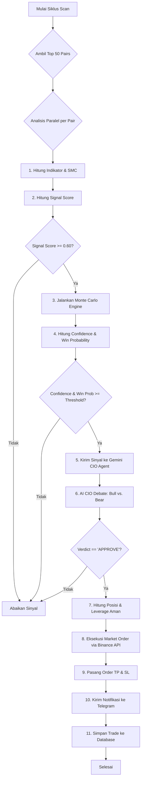
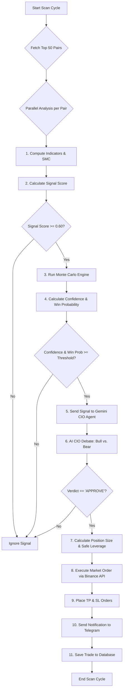

<div align="center">

```
╔══════════════════════════════════════════════════════════════════════════════╗
║                                                                              ║
║      ███╗   ██╗███████╗██████╗  █████╗                                      ║
║      ████╗  ██║██╔════╝██╔══██╗██╔══██╗                                     ║
║      ██╔██╗ ██║█████╗  ██████╔╝███████║                                     ║
║      ██║╚██╗██║██╔══╝  ██╔══██╗██╔══██║                                     ║
║      ██║ ╚████║███████╗██║  ██║██║  ██║                                     ║
║      ╚═╝  ╚═══╝╚══════╝╚═╝  ╚═╝╚═╝  ╚═╝                                     ║
║                                                                              ║
║                Q U A N T   T R A D I N G   A I   •   v1.0                  ║
║                     Monte Carlo Probability Engine                          ║
║                                                                              ║
╚══════════════════════════════════════════════════════════════════════════════╝
```

[](https://python.org)
[](https://testnet.binancefuture.com)
[](https://ai.google.dev)
[](https://core.telegram.org/bots)

</div>

<div align="center">
  <details open>
    <summary><strong>:indonesia: Bahasa Indonesia</strong></summary>
    <p><em>Untuk melihat versi Bahasa Inggris, klik di bawah.</em></p>
  </details>
  <details>
    <summary><strong>:us: English</strong></summary>
    <p><em>To see the Indonesian version, click above.</em></p>
  </details>
</div>

---

<details>
<summary><strong>:indonesia: Bahasa Indonesia</strong></summary>

**NERA QUANT** adalah sistem trading algoritmik AI otonom untuk **Binance Futures**. Sistem ini secara kontinu memindai **Top 50 pair USDT perpetual**, menggabungkan analisis teknikal, **Smart Money Concepts (SMC)**, dan simulasi probabilistik **Monte Carlo** untuk mengidentifikasi dan mengeksekusi peluang trading dengan keyakinan tinggi.

Setiap sinyal divalidasi oleh **Gemini 2.5 Pro** yang bertindak sebagai *Chief Investment Officer (CIO)*, melakukan debat *Bull vs. Bear* sebelum menyetujui eksekusi trade.

### 🌟 Fitur Utama

- **Strategi Hybrid**: Menggabungkan indikator teknikal klasik (EMA, MACD, RSI) dengan Smart Money Concepts (BOS, CHoCH, Order Blocks, FVG) untuk sinyal berkualitas tinggi.
- **Perkiraan Probabilistik**: Menggunakan **Monte Carlo Engine** (5,000 simulasi per sinyal) untuk menghitung probabilitas profit (Win Probability) dan memvalidasi setiap setup.
- **Pengambilan Keputusan Berbasis AI**: **Gemini 2.5 Pro CIO Agent** menganalisis setiap sinyal, lengkap dengan chart dan data historis (RAG), lalu melakukan debat Bull vs. Bear untuk memberikan persetujuan akhir.
- **Eksekusi Otomatis**: Terintegrasi penuh dengan API Binance Futures untuk eksekusi order otomatis, termasuk *dynamic position sizing*, *partial take profit*, dan *breakeven stop loss*.
- **Manajemen Risiko Komprehensif**: Dilengkapi 13 lapisan pengaman, termasuk *Circuit Breaker*, *News Blackout Filter*, *Spread Protection*, dan *Safe Leverage Calculation*.
- **Sistem Adaptif**: Menganalisis performa trading secara terus-menerus untuk menyesuaikan risiko per pair (**Adaptive Risk**) dan memberi bobot pada strategi yang lebih berhasil (**ε-greedy Weighting**).
- **Dashboard & Notifikasi Live**: Dilengkapi antarmuka web real-time dan notifikasi Telegram untuk semua aktivitas trading.

---

### 🏗️ Arsitektur & Alur Kerja

Sistem berjalan dalam beberapa thread terpisah untuk memastikan responsivitas dan stabilitas. Alur kerja utama terjadi pada *scan cycle* setiap 15-60 detik.

#### Diagram Alur Kerja



#### Penjelasan Strategi Trading

Strategi NERA QUANT adalah *multi-layered trend-following & mean-reversion system* yang dirancang untuk menangkap pergerakan impulsif dengan probabilitas tinggi.

1.  **Generasi Sinyal (Signal Generation)**:
    - **Indikator Teknis**: Sistem menggunakan gabungan indikator trend (EMA), momentum (MACD, RSI), dan volatilitas (Bollinger Bands) yang diberi bobot.
    - **Smart Money Concepts (SMC)**: Sinyal diperkuat secara signifikan oleh deteksi *Break of Structure (BOS)*, *Change of Character (CHoCH)*, dan entri pada *Order Block (OB) retest*. Ini adalah inti dari strategi untuk mengidentifikasi sinyal dengan presisi tinggi.
    - **Signal Score**: Semua faktor di atas digabungkan menjadi satu *Signal Score*. Hanya sinyal dengan skor di atas ambang batas (default: 0.60) yang akan diproses lebih lanjut.

2.  **Validasi Probabilitas (Probabilistic Validation)**:
    - Setiap sinyal yang lolos kemudian diuji oleh **Monte Carlo Engine**. Engine ini menyimulasikan 5,000 kemungkinan pergerakan harga di masa depan berdasarkan volatilitas historis pair tersebut.
    - Hasil simulasi memberikan dua metrik krusial:
        1.  **Win Probability**: Probabilitas harga menyentuh Take Profit sebelum Stop Loss.
        2.  **Confidence**: Gabungan dari *Win Probability* dan *Signal Score*, yang merepresentasikan keyakinan keseluruhan pada setup trading.
    - Sinyal harus memenuhi ambang batas `MC_CONFIDENCE_THRESHOLD` dan `MC_MIN_WIN_PROBABILITY` untuk bisa lolos.

3.  **Filter Kontekstual (Contextual Filtering)**:
    - **HTF Gatekeeper**: Sinyal akan **langsung diblokir** jika berlawanan dengan tren pada timeframe yang lebih tinggi (1 Jam). Ini adalah salah satu filter paling penting untuk menghindari *counter-trend trading* yang berisiko.
    - **News Blackout**: Menjelang rilis berita ekonomi berdampak tinggi (FOMC, CPI, dll.), sistem akan berhenti membuka posisi baru untuk menghindari volatilitas ekstrem.

4.  **Persetujuan AI (AI Approval)**:
    - Sinyal terkuat yang lolos semua filter kemudian diserahkan kepada **Gemini 2.5 Pro CIO Agent**.
    - AI melakukan **Debat Multi-Analis**:
        - **Analis Bull**: Memberikan argumen terkuat *untuk* mengambil trade.
        - **Analis Bear**: Memberikan argumen terkuat *melawan* trade tersebut.
    - AI menganalisis data sinyal, **chart visual**, dan **data historis dari trade serupa (RAG)**.
    - Trade hanya akan dieksekusi jika mendapat *verdict* `APPROVE`.

5.  **Eksekusi & Manajemen (Execution & Management)**:
    - Jika disetujui, **BinanceTrader** menghitung ukuran posisi berdasarkan manajemen risiko (`RISK_PER_TRADE`) dan *leverage* yang aman.
    - Sistem mengeksekusi *market order* dan secara otomatis memasang order *Take Profit* dan *Stop Loss*.
    - Jika `ENABLE_PARTIAL_TP` aktif, sistem akan menutup 50% posisi di TP1 dan memindahkan SL ke harga entry (*breakeven*), menciptakan "free trade".

---

### 🛠️ Instalasi & Penggunaan

#### 1. Persiapan

- Pastikan Anda memiliki Python 3.9 atau lebih baru.
- Clone repository ini.
- Instal semua dependensi yang dibutuhkan:
  ```bash
  pip install -r requirements.txt
  ```

#### 2. Konfigurasi

- Salin file `config.example.py` menjadi `config.py`.
  ```bash
  cp config.example.py config.py
  ```
- Buka `config.py` dan isi dengan kredensial Anda.

#### 3. Menjalankan Bot

Gunakan skrip helper yang telah disediakan:

- **Memulai Bot (di latar belakang):**
  ```bash
  ./start.sh
  ```
- **Memeriksa Status:**
  ```bash
  ./status.sh
  ```
- **Menghentikan Bot:**
  ```bash
  ./stop.sh
  ```

#### 4. Backtesting & Data Historis

- **Download/Update Data Historis (3 Bulan Terakhir):**
  ```bash
  ./update_data.sh
  ```
- **Menjalankan Backtest (pada data 3 bulan terakhir):**
  ```bash
  ./update_backtest.sh
  ```

> ⚠️ **DISCLAIMER**: Bot ini adalah perangkat lunak yang kompleks dan ditujukan untuk tujuan riset dan edukasi. Trading futures memiliki risiko yang sangat tinggi. Selalu lakukan riset Anda sendiri (DYOR).

</details>

<details>
<summary><strong>:us: English</strong></summary>

**NERA QUANT** is an autonomous AI algorithmic trading system for **Binance Futures**. It continuously scans the **Top 50 USDT perpetual pairs**, combining technical analysis, **Smart Money Concepts (SMC)**, and **Monte Carlo** probabilistic simulations to identify and execute high-confidence trading opportunities.

Each signal is validated by **Gemini 2.5 Pro**, acting as a *Chief Investment Officer (CIO)*, which conducts a *Bull vs. Bear* debate before approving trade execution.

### 🌟 Key Features

- **Hybrid Strategy**: Combines classic technical indicators (EMA, MACD, RSI) with Smart Money Concepts (BOS, CHoCH, Order Blocks, FVG) for high-quality signals.
- **Probabilistic Forecasting**: Utilizes a **Monte Carlo Engine** (5,000 simulations per signal) to calculate the profit probability (Win Probability) and validate each setup.
- **AI-Powered Decision Making**: A **Gemini 2.5 Pro CIO Agent** analyzes each signal, complete with charts and historical data (RAG), then conducts a Bull vs. Bear debate for final approval.
- **Automated Execution**: Fully integrated with the Binance Futures API for automatic order execution, including dynamic position sizing, partial take profit, and breakeven stop loss.
- **Comprehensive Risk Management**: Equipped with 13 safety layers, including a *Circuit Breaker*, *News Blackout Filter*, *Spread Protection*, and *Safe Leverage Calculation*.
- **Self-Adapting System**: Continuously analyzes trading performance to adjust risk per pair (**Adaptive Risk**) and assign weights to more successful strategies (**ε-greedy Weighting**).
- **Live Dashboard & Notifications**: Features a real-time web interface and Telegram notifications for all trading activities.

---

### 🏗️ Architecture & Workflow

The system runs in multiple separate threads to ensure responsiveness and stability. The main workflow occurs in a *scan cycle* every 15-60 seconds.

#### Workflow Diagram



#### Trading Strategy Explained

NERA QUANT's strategy is a multi-layered trend-following & mean-reversion system designed to capture high-probability impulsive moves.

1.  **Signal Generation**:
    - **Technical Indicators**: The system uses a weighted combination of trend (EMA), momentum (MACD, RSI), and volatility (Bollinger Bands) indicators.
    - **Smart Money Concepts (SMC)**: Signals are significantly strengthened by the detection of *Break of Structure (BOS)*, *Change of Character (CHoCH)*, and entries on *Order Block (OB) retests*. This is the core of the strategy for identifying high-precision signals.
    - **Signal Score**: All the above factors are combined into a single *Signal Score*. Only signals with a score above a threshold (default: 0.60) are processed further.

2.  **Probabilistic Validation**:
    - Each qualified signal is then tested by the **Monte Carlo Engine**. This engine simulates 5,000 possible future price paths based on the pair's historical volatility.
    - The simulation results provide two crucial metrics:
        1.  **Win Probability**: The probability of the price hitting the Take Profit before the Stop Loss.
        2.  **Confidence**: A blend of *Win Probability* and *Signal Score*, representing the overall conviction in the trade setup.
    - A signal must meet the `MC_CONFIDENCE_THRESHOLD` and `MC_MIN_WIN_PROBABILITY` to pass.

3.  **Contextual Filtering**:
    - **HTF Gatekeeper**: A signal is **immediately blocked** if it goes against the trend on a higher timeframe (1-Hour). This is one of the most critical filters to avoid risky counter-trend trades.
    - **News Blackout**: Leading up to high-impact economic news releases (FOMC, CPI, etc.), the system will stop opening new positions to avoid extreme volatility.

4.  **AI Approval**:
    - The strongest signals that pass all filters are then submitted to the **Gemini 2.5 Pro CIO Agent**.
    - The AI conducts a **Multi-Analyst Debate**:
        - The **Bull Analyst** makes the strongest case *for* taking the trade.
        - The **Bear Analyst** makes the strongest case *against* it.
    - The AI analyzes the signal data, a **visual chart**, and **historical data from similar trades (RAG)**.
    - The trade is only executed if it receives an `APPROVE` verdict.

5.  **Execution & Management**:
    - If approved, the **BinanceTrader** calculates the position size based on risk management (`RISK_PER_TRADE`) and a safe leverage.
    - The system executes a *market order* and automatically places *Take Profit* and *Stop Loss* orders.
    - If `ENABLE_PARTIAL_TP` is active, the system closes 50% of the position at TP1 and moves the SL to the entry price (*breakeven*), creating a "free trade".

---

### 🛠️ Installation & Usage

#### 1. Prerequisites

- Ensure you have Python 3.9 or newer.
- Clone this repository.
- Install all required dependencies:
  ```bash
  pip install -r requirements.txt
  ```

#### 2. Configuration

- Copy the `config.example.py` file to `config.py`.
  ```bash
  cp config.example.py config.py
  ```
- Open `config.py` and fill in your credentials.

#### 3. Running the Bot

Use the provided helper scripts:

- **Start the Bot (in the background):**
  ```bash
  ./start.sh
  ```
- **Check Status:**
  ```bash
  ./status.sh
  ```
- **Stop the Bot:**
  ```bash
  ./stop.sh
  ```

#### 4. Backtesting & Historical Data

- **Download/Update Historical Data (Last 3 Months):**
  ```bash
  ./update_data.sh
  ```
- **Run Backtest (on the last 3 months of data):**
  ```bash
  ./update_backtest.sh
  ```

> ⚠️ **DISCLAIMER**: This bot is a complex piece of software intended for research and educational purposes. Futures trading involves a very high risk of capital loss. Always do your own research (DYOR).

</details>
